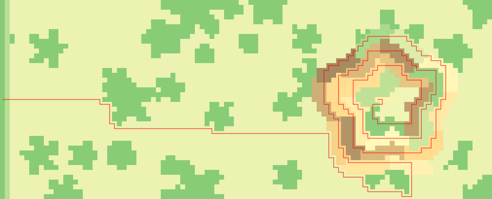
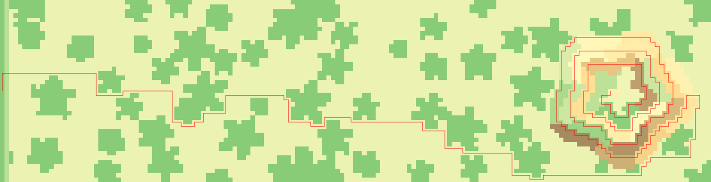

# Advent Of Code 2022 - in C

This year, I try it in C, using only the stdlib.

Have fun!

## Illustration and Animations

Illustration for day 12 for two different datasets:

Animation for day 9:

Animation for day 10:

